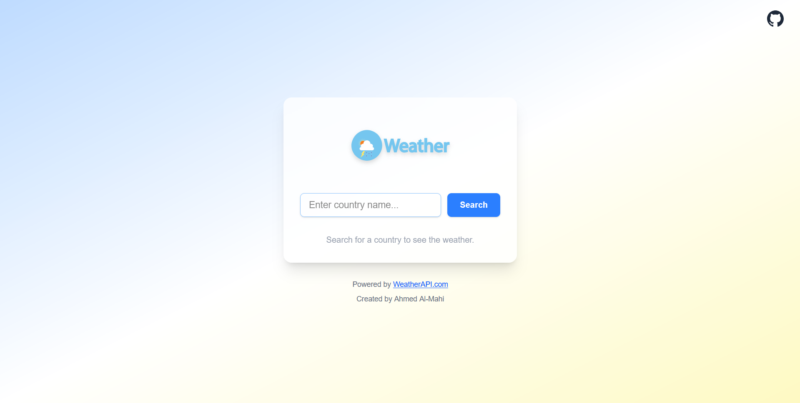
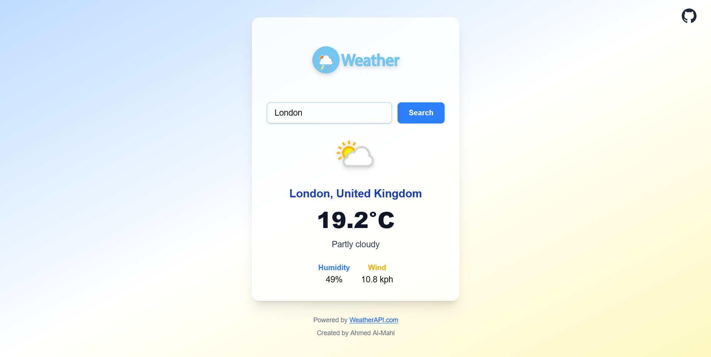
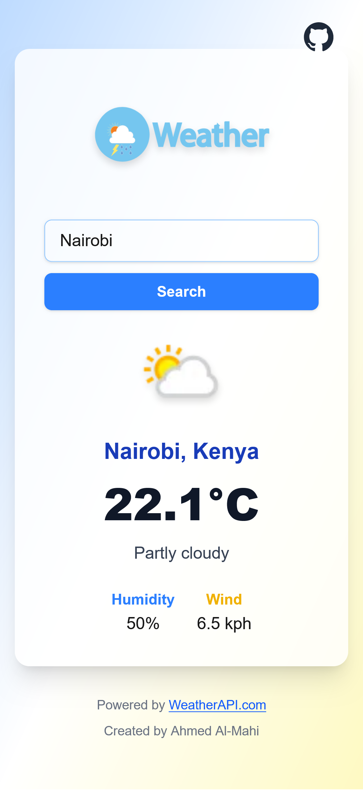

# Weather ☀️🌧️❄️

A beautiful, intuitive, and responsive weather application that provides current and forecasted weather conditions for any location around the globe. Built with a focus on a clean user interface and a seamless user experience.

<div style="display: flex; gap: 20px;">
  <div style="flex: 1;">
    <h3>Desktop View</h3>
    
    
  </div>
  <div style="flex: 1;">
    <h3>Mobile View</h3>
    
  </div>
</div>

## ✨ Features

- **Current Weather Data**: View temperature, weather conditions (sunny, rainy, etc.), humidity and wind speed.
- **Search by City**: Find weather information for any city worldwide.
- **Responsive Design**: Enjoy a consistent experience on desktop, tablet, and mobile devices.
- **Beautiful Icons**: Dynamic weather icons that change based on current conditions.

## 🚀 Live Demo

Check out the live application here: not now

## 🛠️ Built With

This project was built using modern web technologies:

- **Frontend Framework**: Next.js
- **Styling**: Tailwind CSS
- **API**: WeatherAPI.com
- **Icons**: CSS Icons
- **Build Tool**: Create Next App
- **Deployment**: Netlify

## 📦 Installation & Setup

Want to run this project locally or with Docker? Follow these steps:

### 🐳 Docker

You can run this app easily using Docker or Docker Compose.

#### **Build and Run with Docker**

1. **Build the Docker image:**

```bash
docker build -t weather-app .
```

2. **Run the container:**

```bash
docker run -p 3000:3000 --env-file .env weather-app
```

#### **Using Docker Compose**

1. **Start the app:**

```bash
docker-compose up --build
```

2. The app will be available at [http://localhost:3000](http://localhost:3000)

**Note:**

- Make sure you have a `.env` file in the project root with your API key (see below).
- You can stop the containers with `docker-compose down`.

### 💻 Locally

1.  **Clone the repository**

    ```bash
    git clone https://github.com/Ahmed-Almahi/Weather.git
    cd Weather
    ```

2.  **Install dependencies**

    ```bash
    npm install
    # or
    yarn install
    ```

3.  **API Key Setup**

    - Sign up for a free account at [WeatherAPI](https://WeatherAPI.com/api) (or your chosen API provider) to get your API key.
    - Create a `.env` file in the root directory of the project.
    - Add your API key to the `.env` file:
      ```
      VITE_APP_API_KEY=your_actual_api_key_here
      ```
      _Note: The `VITE_` prefix is necessary if you're using Vite. For Create React App, use `REACT_APP_API_KEY`._

4.  **Start the development server**
    ```bash
    npm run dev
    # or
    npm start # You can run this after run 'npx next build --turbopack' to build .next dir
    ```
5.  Open your browser and navigate to `http://localhost:3000` (or the port specified in your terminal).

## 🎯 How to Use

1.  On the app's homepage, you will either see the weather for your current location (if you allowed geolocation) or a default city.
2.  To search for a city, type its name into the search bar and press Enter or click the search button.
3.  View the current weather details in the main card.

## 🔮 API Reference

This application fetches weather data from the **[WeatherAPI API](https://WeatherAPI.com/api)**.

- **Current Weather**: API call to `http://api.weatherapi.com/v1/current.json?q={country}&key={API_KEY}`

## 🤝 Contributing

Contributions, issues, and feature requests are welcome! Feel free to check the [issues page](../../issues) if you want to contribute.

1.  Fork the Project
2.  Create your Feature Branch (`git checkout -b feature/AmazingFeature`)
3.  Commit your Changes (`git commit -m 'Add some AmazingFeature'`)
4.  Push to the Branch (`git push origin feature/AmazingFeature`)
5.  Open a Pull Request

## 📄 License

This project is licensed under the MIT License - see the [LICENSE.md](LICENSE.md) file for details.

## 🙏 Acknowledgments

- Thanks to [WeatherAPI](https://WeatherAPI.com/) for providing the robust weather API.
- Inspiration from various beautiful weather apps on Dribbble and Behance.
- Icons provided by [TailwindCSS](https://tailwindcss.com/).

---

⭐ Star this repo if you found it helpful!
